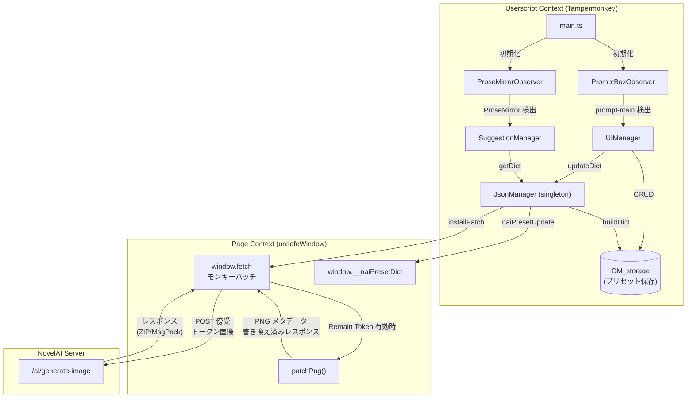

# NovelAI Prompt Preset / Wildcards Manager — Project Overview

## 概要

NovelAI の画像生成ページ (`novelai.net/image`) 上で動作する **Tampermonkey ユーザースクリプト**。
プロンプト中の `__TOKEN__` をユーザー定義のプリセットに自動置換し、プリセットの管理UI・オートコンプリート・メタデータ書き換え等を提供する。

| 項目 | 値 |
|--|--|
| バージョン | 1.4.4 |
| ライセンス | MIT |
| ビルドツール | Vite 7 + [vite-plugin-monkey](https://github.com/nicholasxjy/vite-plugin-monkey) |
| 言語 | TypeScript |
| 対象ページ | `https://novelai.net/*` |
| 外部ライブラリ | JSZip (GreasyFork CDN), @msgpack/msgpack (jsDelivr CDN) |

---

## ディレクトリ構造

```
novelai-prompt-preset-manager-release/
├── src/
│   ├── main.ts                      # エントリーポイント
│   ├── constants.ts                 # GM_storage キー定数
│   ├── style.css                    # 全スタイル定義
│   ├── modules/
│   │   ├── JsonManager.ts           # API インターセプト・トークン置換・PNG メタデータ書き換え
│   │   ├── UIManager.ts             # プリセット管理 UI パネル
│   │   ├── SuggestionManager.ts     # オートコンプリート (サジェスト) 機能
│   │   ├── ProseMirrorObserver.ts   # ProseMirror エディタの DOM 監視
│   │   ├── PromptBoxObserver.ts     # プロンプトボックス (.image-gen-prompt-main) の DOM 監視
│   │   └── translations.ts         # 多言語翻訳 (en/ja/zh/es/id/pt)
│   └── types/
│       ├── globals.d.ts             # Window 拡張・グローバル型宣言
│       └── vite.d.ts                # Vite 型定義
├── dist/                            # ビルド成果物
├── vite.config.ts                   # Vite + vite-plugin-monkey 設定
├── package.json
├── tsconfig.json
└── Readme.md
```

---

## モジュール詳細

### 1. `main.ts` — エントリーポイント

IIFE 内で以下を実行する:

1. **CSS 注入**: `style.css` を `GM_addStyle()` でページに適用
2. **ライブラリ公開**: `JSZip` と `MessagePack` を `unsafeWindow` に紐付け (ページコンテキストで使用可能にする)
3. **言語検出**: `navigator.languages` からユーザー言語を取得し `window.__userLang` に保存
4. **Observer 初期化**:
   - `ProseMirrorObserver` — ProseMirror エディタの出現/消滅を監視し `SuggestionManager` を自動バインド
   - `PromptBoxObserver` — `.image-gen-prompt-main` 要素を監視し `UIManager` を自動注入
5. **レスポンシブ対応**: 900px ブレークポイントの `matchMedia` リスナーでレイアウト変更時にプリセットリストをリフレッシュ

> 重複インスタンス防止のため `window.__naiPmObserver ??=` / `window.__naiPromptObserver ??=` パターンを使用。

---

### 2. `JsonManager.ts` — コアロジック (API インターセプト & メタデータパッチ)

**シングルトン** (`jsonManagerSingleton`) として動作する最重要モジュール。

#### 2.1 プリセット辞書 (`buildDict`)

`GM_listValues()` から `naiPromptPreset:` プレフィックス付きのキーを収集し、`{TOKEN名: 値}` の辞書を構築する。

#### 2.2 ページ側スクリプト注入 (`installPatch`)

`<script>` タグとしてページコンテキストに注入される JavaScript で以下を実現する:

- **`window.fetch` のモンキーパッチ**: `/ai/generate-image` への POST リクエストを傍受
- **`multipart/form-data` 対応**: リクエストボディが `FormData` の場合、`request` パートから JSON Blob を抽出して処理し、置換後は新しい `FormData` を再構築して送信する。従来の plain JSON ボディにも引き続き対応。
- **トークン置換**: リクエストボディ内の `__TOKEN__` パターンを辞書から再帰的 (`deep`) に置換
  - 単一行プリセット → そのまま置換
  - 複数行プリセット → `||line1|line2|line3||` 形式に変換して置換
- **Remain Token 機能**: 有効時、置換前の元プロンプトを `window.__naiLastPromptData` に保存

#### 2.3 PNG メタデータパッチ (`patchPng`)

`Remain Token` が有効な場合、API レスポンスの PNG 画像メタデータを書き換える:

- **ZIP レスポンス** (`binary/octet-stream`): ZIP ファイルを解凍 → PNG 内の `tEXt` チャンクを検索 → Description/Comment キーを元のプロンプトで上書き → 再ZIP化して返却
- **MsgPack ストリームレスポンス** (`application/msgpack`): `ReadableStream` の `TransformStream` で各メッセージをデコード → `event_type === 'final'` の画像データを検出 → PNG パッチ → 再エンコードして流す

PNG バイナリ操作ヘルパー関数:
- `readUint32` / `writeUint32` — ビッグエンディアン 32bit 整数の読み書き
- `crc32` — CRC32 チェックサム計算 (PNG チャンク整合性用)

#### 2.4 辞書更新 (`updateDict`)

辞書を再構築し、`naiPresetUpdate` カスタムイベントでページ側スクリプトに通知する。

---

### 3. `UIManager.ts` — プリセット管理 UI

`PromptBoxObserver` によって `.image-gen-prompt-main` の直後に注入される管理パネル。

#### 主要 UI 要素

| 要素 | 機能 |
|--|--|
| **タイトルバー** | "Prompt Preset / Wildcards Manager" + ⚙️ 設定ギアボタン |
| **テキストエリア** | プリセット内容の編集。改行文字 `\n` を赤いバッジで可視化するオーバーレイ付き |
| **プリセット名入力** | バリデーション: `[A-Za-z0-9_.-]` のみ、36文字以内、`__` 禁止 |
| **ADD ボタン** | プリセットの追加/更新。成功時にフラッシュアニメーション + ポップアップ通知 |
| **CLEAR ボタン** | テキストエリアとプリセット名入力をクリア |
| **▴/▾ トグル** | テキストエリア / プリセットリストの表示/非表示切り替え |
| **プリセットリスト** | チェックボックス付きのプリセット一覧。選択で内容をテキストエリアにロード、✕ ボタンで削除 |
| **検索ボックス** | プリセットリストのリアルタイムフィルタリング (クリアボタン付き) |

#### 設定ポップアップ (⚙️)

| 設定 | 機能 |
|--|--|
| **Import Preset** | JSON ファイルからプリセットをインポート (既存は上書きしない) |
| **Export Preset** | 全プリセットを JSON ファイルとしてエクスポート |
| **Clear All Preset** | 全プリセットを削除 (確認ダイアログ付き) |
| **Remain Preset Token** | 生成画像の PNG メタデータにトークン置換前のプロンプトを残す |
| **Enable Debug Logging** | コンソールにデバッグログを出力 |

#### データ永続化

全てのプリセットは Tampermonkey の `GM_setValue` / `GM_getValue` / `GM_deleteValue` で保存される。
キー形式: `naiPromptPreset:{プリセット名}`

---

### 4. `SuggestionManager.ts` — オートコンプリート

ProseMirror エディタ上で `__` を入力した際にサジェストボックスを表示する。

#### サジェストの種類

| トリガー | サジェスト内容 | 例 |
|--|--|--|
| `__partial` | プリセット名の候補 (token 型) | `__` → `__QUALITY__`, `__hair__` |
| `__tokenName__partial` | プリセット内の個別行 (value 型) | `__hair__bl` → `blonde hair` |

#### 操作

| キー | 動作 |
|--|--|
| `ArrowUp` / `ArrowDown` | 候補を移動 |
| `Tab` / `Space` | 選択した候補を挿入 (token: トークン名, value: その行のテキスト) |
| `Shift+Space` | プリセット内容全体を挿入 (複数行の場合 `\|\|...\|\|` 形式) |
| `Escape` | サジェスト閉じる |
| クリック | 候補を選択 (Shift+クリックで全体挿入) |

#### 実装の仕組み

- `textBeforeCaret()` でキャレット前のテキストを取得
- 正規表現 `/__([A-Za-z0-9_.-]+)__(\w*)$/` (value) と `/__([A-Za-z0-9_.-]*)$/` (token) でマッチング
- `document.execCommand('insertText')` でテキストを挿入 (Undo 対応)
- 候補数は最大 100 件に制限

---

### 5. `ProseMirrorObserver.ts` — ProseMirror エディタ監視

- `MutationObserver` で `document.documentElement` を `childList` + `subtree` で監視
- `div.ProseMirror[contenteditable]` が DOM に追加されると `SuggestionManager` をバインド
- 要素が削除されると `SuggestionManager` を `destroy()` してメモリリークを防止
- `Map<HTMLElement, SuggestionManager>` で各エディタインスタンスを管理

---

### 6. `PromptBoxObserver.ts` — プロンプトボックス監視

- `MutationObserver` で `.image-gen-prompt-main` 要素の出現/消滅を監視
- 出現時に `UIManager` を生成して DOM に挿入、消滅時に `destroy()` で cleanup
- `Map<Element, UIManager>` で各プロンプトボックスに紐づく UI を管理

---

### 7. `translations.ts` — 多言語対応

2 つの翻訳辞書をエクスポート:

| 辞書 | 用途 | 対応言語 |
|--|--|--|
| `messageTranslations` | `alert()` / `confirm()` ダイアログメッセージ | en, ja, zh, es, id, pt |
| `uiMessageTranslations` | UI 上のバリデーションエラー、ツールチップ、通知 | en, ja, zh, es, id, pt |

---

### 8. `constants.ts` — 定数

| 定数 | 値 | 用途 |
|--|--|--|
| `PREFIX` | `'naiPromptPreset:'` | GM_storage のプリセットキー接頭辞 |
| `TOKEN_REMAIN_TRG` | `'naiRemainTokenTrigger'` | Remain Token トグルの保存キー |
| `DEBUG_MODE_TRG` | `'debugModeTrigger'` | デバッグモードトグルの保存キー |

---

### 9. `globals.d.ts` — グローバル型宣言

`Window` インターフェースを拡張:

| プロパティ | 型 | 用途 |
|--|--|--|
| `JSZip` | `typeof JZ` | JSZip ライブラリ参照 |
| `MessagePack` | `typeof MP` | MessagePack ライブラリ参照 |
| `__userLang` | `String` | ユーザー言語コード |
| `__naiPmObserver` | `ProseMirrorObserver` | Observer シングルトン |
| `__naiPromptObserver` | `PromptBoxObserver` | Observer シングルトン |
| `__naiPresetDict` | `Record<string, string>` | ページ側プリセット辞書 |
| `__naiRemain` | `boolean` | Remain Token フラグ |
| `__naiDebugMode` | `boolean` | デバッグモードフラグ |
| `__naiLastPromptData` | `object` | パッチ用の元プロンプトデータ |

---

## データフローダイアグラム



---

## ビルド & 開発

```bash
# 依存インストール
npm install

# 開発 (ファイル変更を監視して自動ビルド)
npm run dev

# 本番ビルド
npm run build
```

ビルド成果物は `dist/` ディレクトリに出力される。`vite-plugin-monkey` が Tampermonkey ヘッダーを自動生成する。

### 外部依存 (CDN 経由で `@require`)

| ライブラリ | 用途 | ソース |
|--|--|--|
| **JSZip** | ZIP 内の PNG メタデータ書き換え | GreasyFork CDN |
| **@msgpack/msgpack** | ストリームレスポンスの MsgPack デコード/エンコード | jsDelivr CDN |

---

## Tampermonkey 権限 (`@grant`)

| 権限 | 用途 |
|--|--|
| `GM_getValue` / `GM_setValue` / `GM_deleteValue` / `GM_listValues` | プリセット・設定の CRUD |
| `GM_addStyle` | CSS 注入 |
| `unsafeWindow` | ページコンテキストへのライブラリ公開 & イベント通知 |

---

## CSS アーキテクチャ (`style.css`)

全スタイルは `.nai-` プレフィックスで名前空間化されており、NovelAI の既存スタイルとの衝突を回避。

| カテゴリ | 主要クラス |
|--|--|
| パネル構造 | `.nai-preset-panel`, `.nai-preset-title`, `.nai-preset-controls` |
| テキストエリア | `.nai-textarea-wrapper`, `.nai-preset-textarea`, `.nai-textarea-overlay` |
| プリセットリスト | `.nai-preset-list`, `.nai-preset-item`, `.nai-btn-remove` |
| 検索 | `.nai-preset-search`, `.nai-preset-search-box`, `.nai-preset-search-clear` |
| 設定ポップアップ | `.nai-popup`, `.nai-gear-btn`, `.nai-remain-row` |
| サジェスト | `.nai-suggest-box`, `.nai-suggest-item` |
| アニメーション | `Flash` (成功), `Flash-Err` (エラー), `nai-fade-in-out` (通知) |

カラースキーム: NovelAI のダークテーマに合わせた暗色系 (`#0e0f21`, `#22253f`, `#262946`)。
アクセントカラー: `#f5f3c2` (淡い黄色)。

### フォーカス管理

`focus-visible` と `data-mouse-clicked` 属性を組み合わせて、キーボードフォーカス時のみアウトラインを表示し、マウスクリック時は非表示にする。

---

## イベントシステム

ユーザースクリプトコンテキストとページコンテキスト間は `CustomEvent` で通信する:

| イベント名 | 方向 | データ |
|--|--|--|
| `naiPresetUpdate` | Userscript → Page | `Record<string, string>` (プリセット辞書) |
| `naiRemainUpdate` | Userscript → Page | `boolean` (Remain Token フラグ) |
| `naiDebugUpdate` | Userscript → Page | `boolean` (デバッグモードフラグ) |
