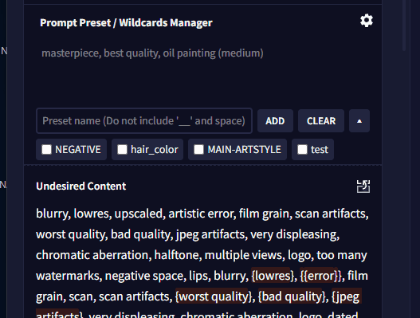
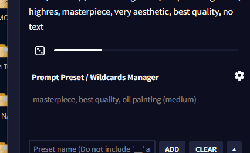
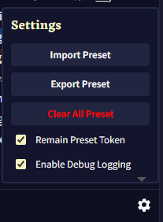

# NovelAI Prompt Preset / Wildcards Manager

A userscript for novelai.net/image that allows you to manage and use prompt presets. It can also format multi-line presets into a special pipe-separated string, useful for certain prompting techniques or organizational purposes. Streamline your workflow by replacing simple `__tokens__` with extensive prompts, character designs, or these specially formatted strings.  

[](https://update.greasyfork.org/scripts/537842/NovelAI%20Prompt%20Preset%20%20Wildcards%20Manager.user.js)

## Demo
### Easy Preset Management
  

### Simple Suggestion Feature (Press Space or Shift+Space)
 

### Replacing Preset Token


### Optionally Rewrite Metadata
 

## Features

-   **Preset Management**: Create, save, and manage reusable prompt snippets.
-   **Multi-line Preset Formatting**: Multi-line presets are automatically formatted into a pipe-separated string (e.g., `||option1|option2||`) when used in prompts.
-   **Live Autocomplete**: Get suggestions for preset names and individual lines from multi-line presets directly in the prompt editor. Supports both token insertion and inline content expansion.
-   **Import & Export**: Back up and share your preset collection as a `.json` file.
-   **PNG Metadata Rewriting**: Optionally save the original prompt (with unexpanded tokens) to the generated PNG's metadata.
-   **Integrated UI**: A management panel is injected directly into the NovelAI image generation page.

## How to Use

### 1. Creating a Preset

1.  Navigate to the NovelAI image generation page. The **Prompt Preset / Wildcards Manager** panel will appear below the main prompt inputs.
2.  In the text area, enter the content you want to save:
    - **Single-line** (e.g., `masterpiece, best quality, cinematic lighting`) — inserted as-is when used.
    - **Multi-line** — each line on a new row. When used, lines are joined into the `||line1|line2||` format. Example for a preset named `hair_styles`:
        ```
        red hair
        blue hair
        blonde hair
        ```
3.  Enter a name in the **Preset name** field (e.g., `QUALITY-TAGS`, `hair_styles`).
4.  Click **ADD**. The preset will appear in the list below.

### 2. Using Presets

In any NovelAI prompt box, type a preset name wrapped in double underscores (e.g., `__QUALITY-TAGS__`).

When the prompt is sent to the API, tokens are replaced with their saved content:
-   Single-line preset → replaced with the text as-is (e.g., `masterpiece, best quality, cinematic lighting`).
-   Multi-line preset → replaced with the pipe-separated format (e.g., `||red hair|blue hair|blonde hair||`). How NovelAI interprets this format depends on NovelAI's own processing.

### 3. Autocomplete

-   **Preset name suggestions**: Type `__` followed by part of a preset name (e.g., `__QUAL`). A suggestion box will appear.
-   **Line-level suggestions**: For multi-line presets, type `__tokenName__partialValue` (e.g., `__hair_styles__bl`) to get matching lines.

| Key | Preset name suggestion | Line-level suggestion |
|-----|------------------------|----------------------|
| `Arrow Keys` | Navigate suggestions | Navigate suggestions |
| `Tab` / `Space` / `Click` | Insert the token (e.g., `__QUALITY-TAGS__`) | Insert that specific line |
| `Shift+Space` / `Shift+Click` | Insert the preset *content* directly | Insert the *entire* preset content |

> Multi-line content is always inserted in `||line1|line2||` format when using Shift selection.

### 4. Managing Your Presets

-   **Load / Edit / Delete**: Check the box next to a preset name to load its content into the text area. A red `×` button will appear for deletion.
-   **Settings (⚙️)**: Click the gear icon to open the settings menu:
    -   **Import / Export** your preset collection.
    -   **Clear All** saved presets.
    -   **Remain Preset Token**: When enabled, the generated PNG's metadata will contain your original prompt with unexpanded tokens (e.g., `1girl, __hair_styles__`).
    -   **Enable Debug Logging** for troubleshooting.

    

## Credits

-   **JSZip**: This script relies on a specific version of JSZip to handle image metadata correctly. Thank you to the maintainer of the **[JSZip fork on GreasyFork](https://greasyfork.org/en/scripts/473358-jszip)** for providing a working solution where the official library had issues.

### Support me!

<a href='https://ko-fi.com/D1D3OZLPE' target='_blank'></a>