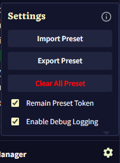

# NovelAI Prompt Preset / Wildcards Manager

A userscript for novelai.net/image that allows you to manage and use prompt presets. It can also format multi-line presets into a special pipe-separated string, useful for certain prompting techniques or organizational purposes. Streamline your workflow by replacing simple `__tokens__` with extensive prompts, character designs, or these specially formatted strings.  

[](https://update.greasyfork.org/scripts/537842/NovelAI%20Prompt%20Preset%20%20Wildcards%20Manager.user.js)

## Demo
### Easy Preset Management
  

### Simple Suggestion Feature (Press Space or Shift+Space)
 

### Replacing Preset Token


### Optionally Rewrite Metadata
 

## Features

-   **Preset Management**: Create, save, and manage reusable prompt snippets.
-   **Multi-line Preset Formatting (for "Wildcard-like" use)**: Automatically formats multi-line presets by replacing newlines with `|` and wrapping the entire content with `||` at the beginning and end (e.g., `||option1|option2||`). This formatted string is then used in the prompt.
-   **Live Autocomplete**: Get live suggestions for your preset names and individual lines from multi-line presets directly in the prompt editor.
-   **Flexible Insertion**:
    -   Normal selection (Tab/Space) for a preset name: Inserts the preset name token (e.g., `__my_preset__`).
    -   Normal selection (Tab/Space/Click) for a line from a multi-line preset (value suggestion `__token__value`): Inserts that specific line, replacing the entire `__token__value` typed.
    -   Shift+Space selection for a preset name: Inserts the *content* of the preset. If the content has multiple lines, it's formatted into the `||line1|line2||` structure.
    -   Shift+Space selection for a line from a multi-line preset (value suggestion `__token__value`): Inserts the *entire original preset content*, formatted into the `||line1|line2||` structure.
-   **Import & Export**: Easily back up and share your entire preset collection as a single `.json` file.
-   **PNG Metadata**: Optionally save the original prompt (with tokens) to the generated PNG's metadata.  
*This feature doesn't compatible with "actual_prompt" key value.*
-   **Easy-to-use UI**: All features are managed through a convenient panel integrated directly into the NovelAI image generation page.

## How to Use

### 1. Creating a Preset (Standard or Multi-line for Special Formatting)

A "preset" is a token that expands into text. If a preset contains multiple lines, the script can format it into a special pipe-separated string.

1.  Navigate to the NovelAI image generation page. The **Prompt Preset / Wildcards Manager** panel will appear below the main prompt inputs.
2.  In the large text area:
    * For a **standard Preset**: Enter the prompt or text you want to save (e.g., `masterpiece, best quality, cinematic lighting`).
    * For a **multi-line Preset** (which will be specially formatted): Enter each option on a new line. For example, a preset named `hair_styles`:
        ```
        red hair
        blue hair
        blonde hair
        ```
3.  In the "Preset name" input field below it, give your preset a short, memorable name (e.g., `QUALITY-TAGS`, `hair_styles`).
4.  Click the **ADD** button. Your new entry will appear in the list below.

### 2. Using Presets

-   **Standard Presets**: In any NovelAI prompt box, type the name of your preset enclosed in double underscores (e.g., `__QUALITY-TAGS__`).
    -   When your prompt is sent to the API (e.g., on image generation), the `__QUALITY-TAGS__` token will be replaced by its saved content (e.g., `masterpiece, best quality, cinematic lighting`).
-   **Multi-line Presets (Special Formatting)**:
    -   If you use a token for a multi-line preset (e.g., `__hair_styles__`), the script which runs before sending data to the API will automatically convert its content.
    -   For the `hair_styles` example above, `__hair_styles__` would be replaced in the final API request data by the string `||red hair|blue hair|blonde hair||`.
    -   How NovelAI interprets this specific `||...|...||` string in the prompt depends on NovelAI's own processing. This script only prepares the string in this format.

### 3. Autocomplete

-   **For Preset Names**: To get suggestions, type `__` and begin typing the preset's name (e.g., `__QUAL` or `__hair_s`). A suggestion box will appear.
    -   Use `Arrow Keys` to navigate.
    -   `Tab` or `Space`: Selects and completes the token name (e.g., to `__QUALITY-TAGS__`).
    -   `Shift+Space`: Selects and inserts the *content* of the preset. If the preset content has multiple lines (like `hair_styles`), it will be inserted in the `||line1|line2||` format. Otherwise, the plain content is inserted.
-   **For Specific Lines (from multi-line presets)**: If a preset contains multiple lines, you can get suggestions for individual lines by typing the token in the format `__tokenName__partialValue` (e.g., `__hair_styles__bl`). The suggestion box will show matching lines (e.g., `blonde hair`).
    -   `Tab` or `Space` (or Click): Inserts that specific line (e.g., `blonde hair`), replacing the entire `__hair_styles__bl` you typed.
    -   `Shift+Space`: Inserts the *entire original preset content* of `hair_styles`, formatted as `||red hair|blue hair|blonde hair||`, replacing the `__hair_styles__bl` you typed.

### 4. Managing Your Presets

-   **Load/Edit/Delete**: In the list, check the box next to a name. This will load its content into the text area for editing and also reveal a red `×` button to delete it.
-   **Settings (⚙️)**: Click the gear icon in the top-right of the manager panel to open the settings menu. From here you can:
    -   Import or Export your collection.
    -   Clear all saved presets.
    -   Toggle the **Remain Preset Token** feature. When enabled, the final generated PNG file will contain your *original* prompt (e.g., `1girl, __hair_styles__`, `__QUALITY-TAGS__`) in its metadata.
    -   Toggle **Enable Debug Logging** for troubleshooting.  
    
    

## Credits

-   **JSZip**: This script relies on a specific version of JSZip to handle image metadata correctly. Thank you to the maintainer of the **[JSZip fork on GreasyFork](https://greasyfork.org/en/scripts/473358-jszip)** for providing a working solution where the official library had issues.

### Support me!

<a href='https://ko-fi.com/D1D3OZLPE' target='_blank'></a>